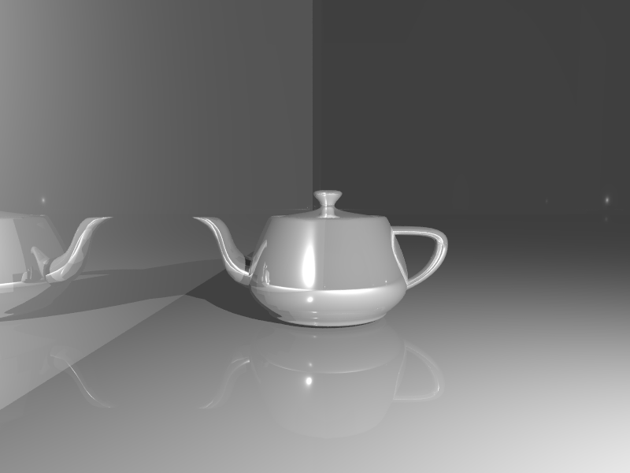
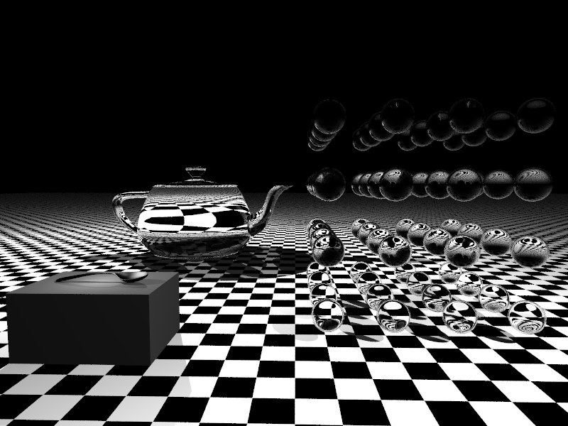
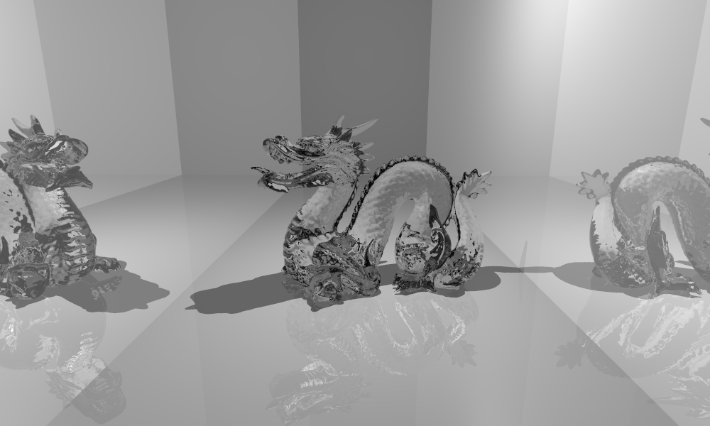

# RayTracerCMAKE

Porting RayTracer to CMake.

Implementing a simple ray tracer.

The ray tracer is partially based on the "pbrt" described in the book "Physically Based Rendering" and the book "Fundamentals of Computer Graphics". The most part will be developed independetly of those books, since I am interested in coming up with my own ideas as this will be more fun this way. Usually, this will mean that this ray tracer will not have the most efficient algorithms in it, of course.

# Example scene 1 (Utah teapot, two point light sources)

# Example scene 2 (glass objects, teaspoon and textured floor)

# Example scene 3 (glass stanford dragon with mirrors)

